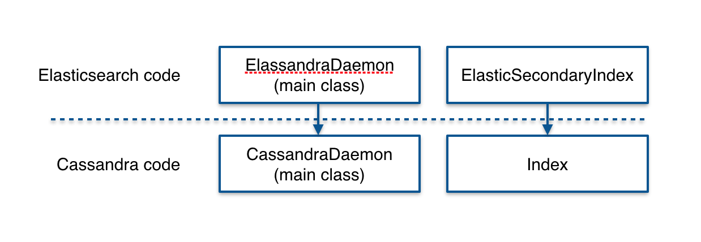
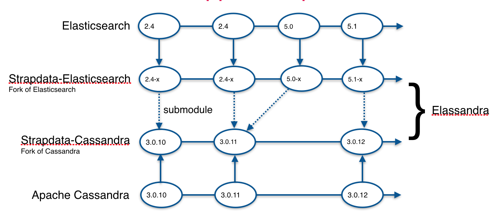

# 如何贡献

Elassandra基于Elasticsearch的分支，作为Apache Cassandra的插件 :
* ElassandraDaemon类覆盖CassandraDaemon，以便管理Elasticsearch内部服务。
* ElasticSecondaryIndex类实现Cassandra Index接口以写入Elasticsearch索引。

为了实现这些操作，Cassandra和Elasticsearch都需要在两个分叉中进行一些修改：

一个 fork 分支 [Apache Cassandra](http://git-wip-us.apache.org/repos/asf/cassandra.git) 包括轻微修改，请参见 (https://github.com/strapdata/cassandra).

一个 fork  Elasticsearch 5.5.0 (aka Strapdata-Elasticsearch, branch *${version}-strapdata*) 包括修改 :
* 群集状态管理([org.elassandra.cluster.InternalCassandraClusterService](/core/src/main/java/org/elassandra/cluster/InternalCassandraClusterService.java) 重写修改为 [org.elasticsearch.cluster.service.InternalClusterService](/core/src/main/java/org/elasticsearch/cluster/service/InternalClusterService.java))
* Gateway to retrieve Elasticsearch metadata on startup (see [org.elassandra.gateway](/core/src/main/java/org/elassandra/gateway/CassandraGatewayService.java))
* Discovery to manage alive cluster members (see [org.elassandra.discovery.CassandraDiscovery](/core/src/main/java/org/elassandra/discovery/CassandraDiscovery.java))
* Fields mappers to manage CQL mapping and Lucene field factory (see [org.elasticsearch.index.mapper.core](/core/src/main/java/org/elasticsearch/index/mapper/core))
* Search requests routing (see [org.elassandra.cluster.routing](/core/src/main/java/org/elassandra/cluster/routing))

如下所示，fork的Cassandra和Elasticsearch项目可以独立更改，并且可以定期将更改改为Strapdata-Cassandra or Elassandra (aka Strapdata-Elasticsearch).

Elassandra包含2个引用 [strapdata-cassandra](https://github.com/strapdata/cassandra) :
* The Elassandra version 5+ **core/pom.xml** include a maven dependency on the strapdata-cassandra project
* The Elassandra version 6+ **buildSrc/version.properties** include a gradle dependency on the strapdata-cassandra project.
* In order to build the elassandra tarball and packages, the elassandra project includes a reference to the [strapdata-cassandra](https://github.com/strapdata/cassandra) as git submodule located in **core/cassandra** for version 5+ or **server/cassandra** for version 6+.

Elassandra是一个开源项目，欢迎贡献者提出问题或提出请求 [strapdata-cassandra](https://github.com/strapdata/cassandra) or [elassandra](https://github.com/strapdata/elassandra) github repositories.

## Bug reports

When submitting an issue, please make sure that :

* You are testing against the latest version of Elassandra.
* You're not in the case of a known Elassandra limitation, see http://doc.elassandra.io/en/latest/limitations.html.
* Elassandra behavior is abnormally different from the standard Cassandra or Elasticsearch. For example, like Elasticsearch, Elassandra does not display default mappings unless requested, but this is the expected behavior.

It is very helpful if you can provide a test case to reproduce the bug and the associated error logs or stacktrace. See your **conf/logback.xml** to increase logging level in the **logs/system.log** file, and run **nodetool setlogginglevel** to dynamically update your logging level.

## Feature requests

Your're welcome to rise an issue on https://github.com/strapdata/elassandra for new feature, describing why and how it should work.

## 促成代码和文档更改

贡献者可以克隆存储库并遵循Elasticsearch和Cassandra的指导原则 :
* [为elasticsearch代码库做出贡献](https://github.com/elastic/elasticsearch/blob/2.4/CONTRIBUTING.md#contributing-to-the-elasticsearch-codebase)
* [Cassandra如何贡献](https://wiki.apache.org/cassandra/HowToContribute)ls 

当克隆Elassandra时, 使用 

  `git clone --recurse-submodules https://github.com/strapdata/elassandra`

克隆 strapdata-cassandra 子模块，并检查您正在使用的 strapdata-cassandra 版本在 *core/pom.xm*  是否相同。 elassandra v5.x (or *buildSrc/version.properties* for v6.x) 并且在子模块. 或者, 该子模块可以指向您自己的cassandra分支, 假设该分支包含支持Elassandra的强制修改，请参见 [strapdata-cassandra](https://github.com/strapdata/cassandra) 有关详细信息.

如果当clone时候你忘了 **--recurse-submodules** , 您还可以使用 **git submodule update --init** 和 **git checkout cassandra-3.x-strapdata** 设置strapdata分支.

然后，构建源码: 

* Elassandra v5.x:

      gradle clean assemble -Dbuild.snapshot=false
    
    
* Elassandra v6.2.x:
      
      export JAVA_HOME=/path/to/jdk-10
      export CASSANDRA_JAVA_HOME=/path/to/jdk-8
      ./gradlew clean assemble -Dbuild.snapshot=false

* Elassandra v6.8.x:
      
      export JAVA8_HOME=/path/to/jdk-8
      export JAVA9_HOME=/path/to/jdk-9
      export JAVA12_HOME=/path/to/jdk-12
      export JAVA_HOME=/path/to/jdk-12
      export CASSANDRA_JAVA_HOME=/path/to/jdk-8
      ./gradlew clean assemble -Dbuild.snapshot=false
      
Note: For elassandra v6.X, javadoc task failed due to [https://bugs.java.com/bugdatabase/view_bug.do?bug_id=8194281](https://bugs.java.com/bugdatabase/view_bug.do?bug_id=8194281).

Elassandra documentation is based on [sphinx](http://www.sphinx-doc.org/en/stable/rest.html) and published on [readthedoc.org](https://readthedocs.org/). 
Source RestructuredText files are located at [Elassandra source documentation](https://github.com/strapdata/elassandra/tree/master/docs/elassandra). 
To build the documentation, just run **make html** from the *${project.dir}/docs/elassandra*.

### Submitting your changes

1. Test you changes

You can build Elassandra single-node unit tests mixing Elasticsearch and Cassandra CQL/nodetool requests. 
See [Elassandra Testing](http://doc.elassandra.io/en/latest/testing.html) documentation and 
existing [Elassandra unit tests](https://github.com/strapdata/elassandra/tree/master/core/src/test/java/org/elassandra). 
For multi-nodes testing, you can use [ecm](https://github.com/strapdata/ecm), a fork of [ccm](https://github.com/pcmanus/ccm) 
running Elassandra.

2. Rebase your changes

Like with Elasticsearch, update your local repository with the most recent code from the main Elassandra repository, 
and rebase your branch on top of the latest master branch. We prefer your initial changes to be squashed into a single 
commit. Later, if we ask you to make changes, add them as separate commits. This makes them easier to review. 
As a final step before merging we will either ask you to squash all commits yourself or we'll do it for you.

3. Submit a pull request

Finally, push your local changes to your forked copy of the elassandra repository and [submit a pull request](https://help.github.com/articles/using-pull-requests). In the pull request, choose a title which sums up the changes that you have made, including the issue number (ex: #91 null_value support), and provide details about your changes.

As usual, you should never force push to a publicly shared branch, but add incremental commits.
