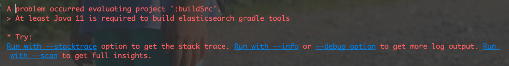

# Elassandra [](https://travis-ci.org/strapdata/elassandra) [](https://elassandra.readthedocs.io/en/latest/?badge=latest) [](https://github.com/strapdata/elassandra/releases/latest)
[](https://twitter.com/strapdataio)


## [http://www.elassandra.io/](http://www.elassandra.io/)

## 这里是我的笔记
说明：Elassandra 这东西，如果要是看过Elasticsearch源码层级结果从新封装的。而且里边有些文档记录，目测都没有修改过。
本身Elasticsearch的server模块，就是核心服务的代码。在这个项目里也可以看看server文件夹。里边可以看到整合了cassandra。

目前源码还没跑起来，使用了jdk17目测不行，问题还是很多。
感觉应该是Elasticsearch没有使用最新代码的原因。

### 最新版本jdk要求
需要最低版本为jdk11，使用jdk8 会报错



Elassandra是Apache Cassandra发行版，包含Elasticsearch搜索引擎。

Elassandra是一个多主多云数据库和搜索引擎，支持在主动/主动模式下跨多个数据中心复制。

Elasticsearch代码嵌入到Cassandra节点中，在Cassandra表上提供高级搜索功能，Cassandra用作Elasticsearch数据和配置存储。


Elassandra支持Cassandra vnode，通过添加更多节点而不需要重新分片索引来水平扩展

项目文档可在 [doc.elassandra.io](http://doc.elassandra.io).


## Elassandra的好处

对于Cassandra用户，elassandra提供了Elasticsearch特性:

* Cassandra更新在Elasticsearch中被索引。

* 对Cassandra数据进行全文和空间搜索。

* 实时聚合(不需要Spark或Hadoop GROUP BY)

* 在一个查询中提供对多个键空间和表的搜索。
  
* 提供自动模式创建和支持使用嵌套文档 [User Defined Types](https://docs.datastax.com/en/cql/3.1/cql/cql_using/cqlUseUDT.html).

* 提供Cassandra数据的读/写JSON REST访问。
  
* 可以使用众多的Elasticsearch插件和产品 [Kibana](https://www.elastic.co/guide/en/kibana/current/introduction.html).
  
* 管理并发elasticsearch映射更改并应用批处理原子CQL模式更改。

* 支持 [Elasticsearch ingest processors](https://www.elastic.co/guide/en/elasticsearch/reference/master/ingest.html) 允许转换输入数据.

对于Elasticsearch用户，elassandra提供了有用的功能 :
* Elassandra 是无主的模式。群集状态通过管理 [cassandra lightweight transactions](http://www.datastax.com/dev/blog/lightweight-transactions-in-cassandra-2-0).
* Elassandra是一个分片多主数据库，Elasticsearch是分片主从数据库。因此，Elassandra没有单点写入，有助于实现高可用性.
* Elassandra继承了Cassandra数据修复机制（暗示切换、读取修复和节点工具修复），为 **跨数据中心复制**.
* 在Elasandra集群中添加节点时，Elasticsearch中仅对从现有节点提取的数据进行重新索引.
* Cassandra可以是索引和非索引数据的唯一数据存储。它更易于管理和安全。源文档现在存储在Cassandra中，如果您需要NoSQL数据库和Elasticsearch，可以减少磁盘空间.
* 写操作不限于一个主分片，而是分布在虚拟数据中心的所有Cassandra节点上。分片的数量不会限制写入吞吐量。添加elassandra节点可提高读写吞吐量.
* Elasticsearch索引可以在许多Cassandra数据中心之间复制，允许写入最近的数据中心并进行全局搜索.
* [cassandra driver](http://www.planetcassandra.org/client-drivers-tools/) 支持数据中心和令牌，提供自动负载平衡和故障切换.
* Elassandra高效地将Elasticsearch文档存储在二进制SSTables中，无需任何JSON开销。.

## 快速开始

* [快速开始](http://doc.elassandra.io/en/latest/quickstart.html) 在docker中运行单节点Elassandra集群的指南。.
* [通过启动Google Kubernetes引擎部署Elassandra](./docs/google-kubernetes-tutorial.md):

  [](https://console.cloud.google.com/cloudshell/open?git_repo=https://github.com/strapdata/elassandra-google-k8s-marketplace&tutorial=docs/google-kubernetes-tutorial.md)
  
## 升级说明


#### Elassandra 6.8.4.2+

<<<<<<< HEAD
Since version 6.8.4.2, the gossip X1 application state can be compressed using a system property. Enabling this settings allows the creation of a lot of virtual indices.
Before enabling this setting, upgrade all the 6.8.4.x nodes to the 6.8.4.2 (or higher). Once all the nodes are in 6.8.4.2, they are able to decompress the application state even if the settings isn't yet configured locally.

#### Elassandra 6.2.3.25+

Elassandra use the Cassandra GOSSIP protocol to manage the Elasticsearch routing table and Elassandra 6.8.4.2+ add support for compression of
the X1 application state to increase the maxmimum number of Elasticsearch indices. For backward compatibility, the compression is disabled by default, 
but once all your nodes are upgraded into version 6.8.4.2+, you should enable the X1 compression by adding **-Des.compress_x1=true** in your **conf/jvm.options** and rolling restart all nodes.
Nodes running version 6.8.4.2+ are able to read compressed and not compressed X1.

#### Elassandra 6.2.3.21+

Before version 6.2.3.21, the Cassandra replication factor for the **elasic_admin** keyspace (and elastic_admin_[datacenter.group]) was automatically adjusted to the 
number of nodes of the datacenter. Since version 6.2.3.21 and because it has a performance impact on large clusters, it's now up to your Elassandra administrator to 
properly adjust the replication factor for this keyspace. Keep in mind that Elasticsearch mapping updates rely on a PAXOS transaction that requires QUORUM nodes to succeed, 
so replication factor should be at least 3 on each datacenter.

#### Elassandra 6.2.3.19+

Elassandra 6.2.3.19 metadata version now relies on the Cassandra table **elastic_admin.metadata_log** (that was **elastic_admin.metadata** from 6.2.3.8 to 6.2.3.18) 
to keep the elasticsearch mapping update history and automatically recover from a possible PAXOS write timeout issue. 

When upgrading the first node of a cluster, Elassandra automatically copy the current **metadata.version** into the new **elastic_admin.metadata_log** table.
To avoid Elasticsearch mapping inconsistency, you must avoid mapping update while the rolling upgrade is in progress. Once all nodes are upgraded,
the **elastic_admin.metadata** is not more used and can be removed. Then, you can get the mapping update history from the new **elastic_admin.metadata_log** and know
which node has updated the mapping, when and for which reason.

#### Elassandra 6.2.3.8+

Elassandra 6.2.3.8+ now fully manages the elasticsearch mapping in the CQL schema through the use of CQL schema extensions (see *system_schema.tables*, column *extensions*). These table extensions and the CQL schema updates resulting of elasticsearch index creation/modification are updated in batched atomic schema updates to ensure consistency when concurrent updates occurs. Moreover, these extensions are stored in binary and support partial updates to be more efficient. As the result, the elasticsearch mapping is not more stored in the *elastic_admin.metadata* table. 

WARNING: During the rolling upgrade, elasticserach mapping changes are not propagated between nodes running the new and the old versions, so don't change your mapping while you're upgrading. Once all your nodes have been upgraded to 6.2.3.8+ and validated, apply the following CQL statements to remove useless elasticsearch metadata:
```bash
ALTER TABLE elastic_admin.metadata DROP metadata;
ALTER TABLE elastic_admin.metadata WITH comment = '';
```

WARNING: Due to CQL table extensions used by Elassandra, some old versions of **cqlsh** may lead to the following error message **"'module' object has no attribute 'viewkeys'."**. This comes from the old python cassandra driver embedded in Cassandra and has been reported in [CASSANDRA-14942](https://issues.apache.org/jira/browse/CASSANDRA-14942). Possible workarounds:
* Use the **cqlsh** embedded with Elassandra
* Install a recent version of the  **cqlsh** utility (*pip install cqlsh*) or run it from a docker image:

```bash
docker run -it --rm strapdata/cqlsh:0.1 node.example.com
```

#### Elassandra 6.x changes

* Elasticsearch now supports only one document type per index backed by one Cassandra table. Unless you specify an elasticsearch type name in your mapping, data is stored in a cassandra table named **"_doc"**. If you want to search many cassandra tables, you now need to create and search many indices.
* Elasticsearch 6.x manages shard consistency through several metadata fields (_primary_term, _seq_no, _version) that are not used in elassandra because replication is fully managed by cassandra.

## Installation

确保已安装Java 8并且“Java_HOME”指向正确的位置。

* [下载](https://github.com/strapdata/elassandra/releases) 并提取分配 tarball
* 定义CASSANDRA_HOME环境变量 : `export CASSANDRA_HOME=<extracted_directory>`
* 运行 `bin/cassandra -e`
* 运行 `bin/nodetool status`
* 运行 `curl -XGET localhost:9200/_cluster/state`

#### Example

尝试在不存在的索引上为文档编制索引：

```bash
curl -XPUT 'http://localhost:9200/twitter/_doc/1?pretty' -H 'Content-Type: application/json' -d '{
    "user": "Poulpy",
    "post_date": "2017-10-04T13:12:00Z",
    "message": "Elassandra adds dynamic mapping to Cassandra"
}'
```

然后在Cassandra中查找：

```bash
bin/cqlsh -e "SELECT * from twitter.\"_doc\""
```

在后台，Elassandra创建了一个新的Keyspace `twitter` 和 表 `_doc`.

```CQL
admin@cqlsh>DESC KEYSPACE twitter;

CREATE KEYSPACE twitter WITH replication = {'class': 'NetworkTopologyStrategy', 'DC1': '1'}  AND durable_writes = true;

CREATE TABLE twitter."_doc" (
    "_id" text PRIMARY KEY,
    message list<text>,
    post_date list<timestamp>,
    user list<text>
) WITH bloom_filter_fp_chance = 0.01
    AND caching = {'keys': 'ALL', 'rows_per_partition': 'NONE'}
    AND comment = ''
    AND compaction = {'class': 'org.apache.cassandra.db.compaction.SizeTieredCompactionStrategy', 'max_threshold': '32', 'min_threshold': '4'}
    AND compression = {'chunk_length_in_kb': '64', 'class': 'org.apache.cassandra.io.compress.LZ4Compressor'}
    AND crc_check_chance = 1.0
    AND dclocal_read_repair_chance = 0.1
    AND default_time_to_live = 0
    AND gc_grace_seconds = 864000
    AND max_index_interval = 2048
    AND memtable_flush_period_in_ms = 0
    AND min_index_interval = 128
    AND read_repair_chance = 0.0
    AND speculative_retry = '99PERCENTILE';
CREATE CUSTOM INDEX elastic__doc_idx ON twitter."_doc" () USING 'org.elassandra.index.ExtendedElasticSecondaryIndex';
```

默认情况下，多值Elasticsearch字段映射到Cassandra列表。
现在, 用 CQL 插入一行数据 :

```CQL
INSERT INTO twitter."_doc" ("_id", user, post_date, message)
VALUES ( '2', ['Jimmy'], [dateof(now())], ['New data is indexed automatically']);
SELECT * FROM twitter."_doc";

 _id | message                                          | post_date                           | user
-----+--------------------------------------------------+-------------------------------------+------------
   2 |            ['New data is indexed automatically'] | ['2019-07-04 06:00:21.893000+0000'] |  ['Jimmy']
   1 | ['Elassandra adds dynamic mapping to Cassandra'] | ['2017-10-04 13:12:00.000000+0000'] | ['Poulpy']

(2 rows)
```

然后用 Elasticsearch API 进行搜索:

```bash
curl "localhost:9200/twitter/_search?q=user:Jimmy&pretty"
```

下面是一个示例响应 :

```JSON
{
  "took" : 3,
  "timed_out" : false,
  "_shards" : {
    "total" : 1,
    "successful" : 1,
    "skipped" : 0,
    "failed" : 0
  },
  "hits" : {
    "total" : 1,
    "max_score" : 0.6931472,
    "hits" : [
      {
        "_index" : "twitter",
        "_type" : "_doc",
        "_id" : "2",
        "_score" : 0.6931472,
        "_source" : {
          "post_date" : "2019-07-04T06:00:21.893Z",
          "message" : "New data is indexed automatically",
          "user" : "Jimmy"
        }
      }
    ]
  }
}
```

## 支持

 * 可通过以下方式获得商业支持 [Strapdata](http://www.strapdata.com/).
 * 社区支持可通过 [elassandra google groups](https://groups.google.com/forum/#!forum/elassandra).
 * 发布功能请求和bug在 https://github.com/strapdata/elassandra/issues

## License

```
此软件根据Apache许可证获得许可, version 2 ("ALv2"), 引用如下.

Copyright 2015-2018, Strapdata (contact@strapdata.com).

根据Apache许可证许可, Version 2.0 (the "License"); 除非符合许可证，否则不得使用此文件。您可以在以下地址获取许可证副本：

    http://www.apache.org/licenses/LICENSE-2.0

除非适用法律要求或书面同意, 根据许可证分发的软件按“原样”分发, 无任何保证或条件, 明示或暗示的。有关许可证下权限和限制的特定语言，请参阅许可证.
```

## 致谢

* Elasticsearch, Logstash, Beats and Kibana 是商标 Elasticsearch BV, 在美国和其他国家注册.
* Apache Cassandra, Apache Lucene, Apache, Lucene and Cassandra 是Apache Software Foundation的商标.
* Elassandra是Strapdata SAS的商标.
